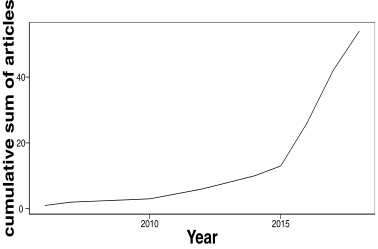

# README

## Into the wild: microbiome transplant studies need broader ecological reality

#### Authors

Christopher J. Greyson-Gaito*1,:heavy_plus_sign:, Timothy J. Bartley1,2,:heavy_plus_sign:, Karl Cottenie1,:heavy_plus_sign:, William Jarvis3,:heavy_plus_sign:, Amy E.M. Newman1,:heavy_plus_sign:, Mason R. Stothart4,:heavy_plus_sign:

#### Affiliations

*Corresponding author - christopher@greyson-gaito.com

1. University of Guelph, Department of Integrative Biology, Guelph, ON, Canada
2. University of Toronto Mississauga, Mississauga, ON, Canada
3. University of Ottawa, Department of Biology, Ottawa, ON,Canada
4. University of Calgary, Calgary, AB, Canada

:heavy_plus_sign: All authors contributed equally

### Folder and file structure
* data
    * EcoRealTable_2019-03-25_Data.csv
* figs
    * 2019-03-07 CountAnimals.pdf	Figure 2 in manuscript
    * 2019-03-07 Eco-realityComparisons.pdf  Figure 3 in manuscript
    * 2019-03-07 Eco-realityAverageStandardOverTime.pdf  Figure 4 in manuscript
    * 2019-04-25 CumulativeSumArticles.pdf  Supporting Information Figure 1
* .gitignore  File containing files or folders that git should ignore
* IntotheWilde_Microbiome_Greyson-Gaito_etal_2019.R  R script for analysis and figure creation
* LICENSE  Mozilla Public License 2.0
* README.md  Important information
* meta_transplant_microbiome.Rproj  R Project to increase ease of use

### Instructions for use
* Download the whole repository (either by forking and cloning or by downloading a ZIP folder)
* In RStudio, open the project called meta_transplant_microbiome.Rproj and open the file Intothewild_Microbiome_Greyson-Gaito_etal_2019.R
	* If not using RStudio, open the file Intothewild_Microbiome_Greyson-Gaito_etal_2019.R and edit the path to the data file called Microbiome_Literature_Summaries.csv to whatever path is required on your computer.
* Run the script in RStudio or however you normally run R scripts.

### Supporting Information

#### Search terms used for methodological literature search

* Google scholar
	* (transplant* AND microbio*) (gut OR fecal OR feces OR gastointestin* OR gasto-intestin* OR faecal OR faeces OR forces OR faecal) -human -patient -"homo sapiens" -man -woman -child*
* Web of Science
	* ((TOPIC:(transplant*) AND TOPIC: (microbio*))AND (TOPIC: ((((((((gut OR fecal) OR feces) OR gastointestin*) OR gasto-intestin*) OR faecal) OR faeces) OR forces) OR faecal) NOT TOPIC:(((((human OR patient) OR homo sapiens) OR man) OR woman) OR child*)))

Figure 1 Cumulative sum of articles from our directed review between 2006 and 2018.
